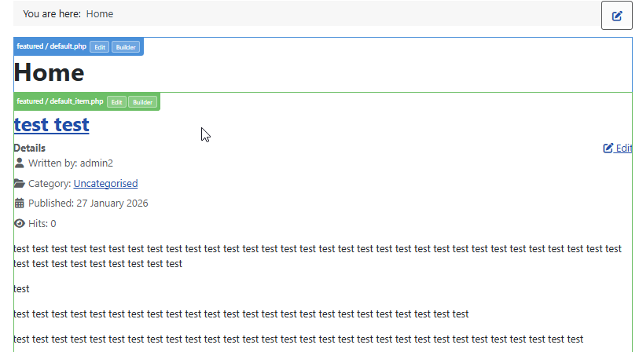
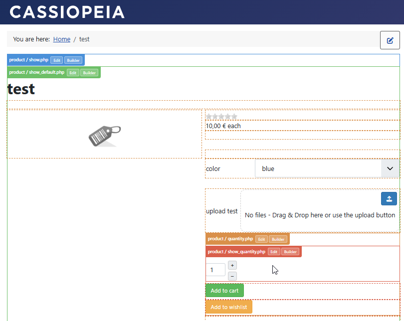
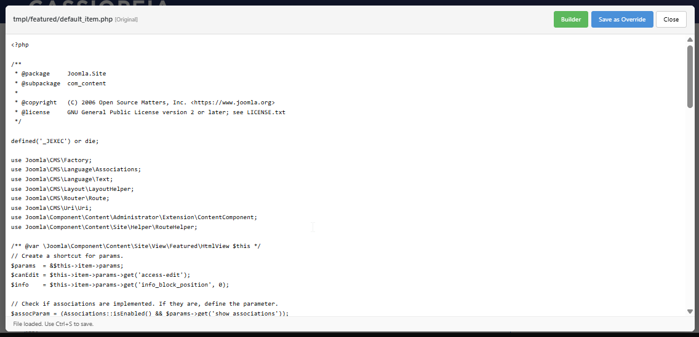
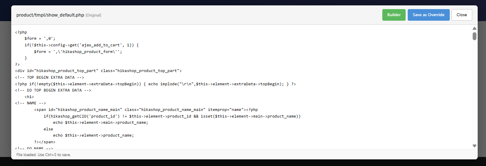
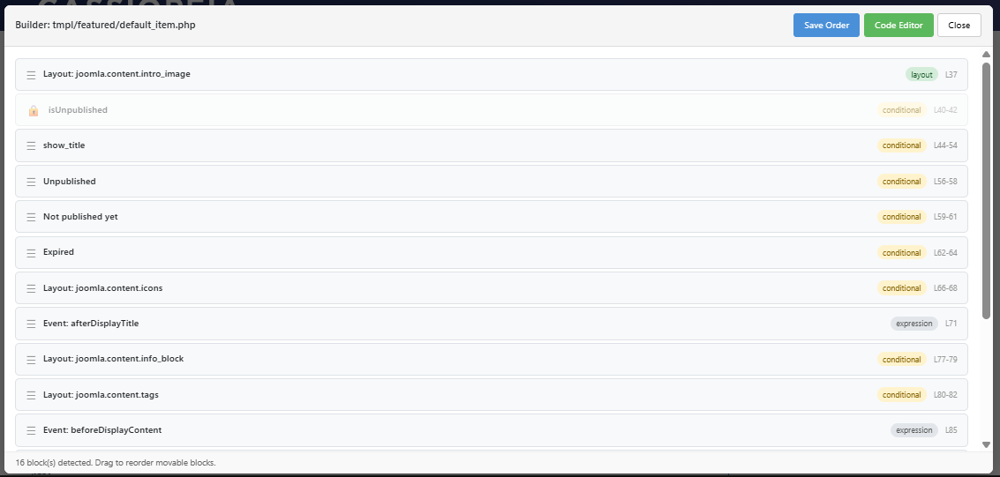
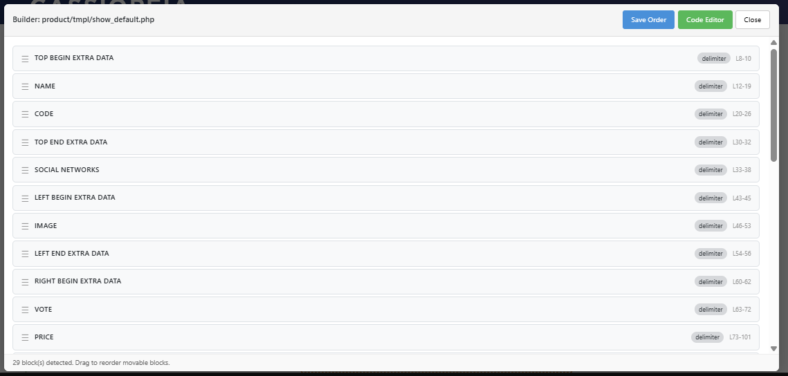

# Joomla View Builder System Plugin

A powerful system plugin for Joomla that allows developers and administrators to customize extension views directly from the website frontend (and backend) by automatically generating template overrides.

## Features

- **Two Modes**: Choose between "On Page" (default) for inline block editing and drag-and-drop, or "Popup" for hover labels with code editor and builder popups.
- **On-Page Editing**: Drag blocks directly on the rendered page to reorder them. Edit individual block code via a click.
- **Popup Editing**: Edit entire view files in a code editor popup, or use the visual builder to reorder blocks in a modal.
- **Safe Overrides**: Automatically creates template overrides in `templates/[your_template]/html/`. Never modifies core files directly.
- **Auto-Delimited Overrides**: In on-page mode, the plugin automatically creates override files with `@block`/`@endblock` delimiters around detected blocks.
- **Syntax Validation**: Checks PHP syntax before saving to prevent "White Screen of Death" errors.
- **Access Control**: Restrict usage to specific user groups (default: Super Users).
- **Flexible Activation**:
  - Frontend only
  - Frontend & Backend
  - Or via `tp=1` URL parameter (Template Preview mode)
- **Easy Revert**: One-click revert to delete the override and restore the original view.

## Preview

### In-Context Editing
The plugin wraps view segments with labels and action buttons, allowing you to instantly identify and edit any part of the page.

| Joomla Core | HikaShop |
| :---: | :---: |
|  |  |

### Code Editor
Edit the PHP/HTML code directly in your browser with tab support and keyboard shortcuts (Ctrl+S).

| Joomla Core | HikaShop |
| :---: | :---: |
|  |  |

### Visual Builder
Reorder blocks within a view file using a drag-and-drop interface.

| Joomla Core | HikaShop |
| :---: | :---: |
|  |  |

## Installation

1. Download the plugin package.
2. Install via the Joomla Extension Manager.
3. Go to **System > Plugins** and enable the plugin `System - View Builder`.
4. **Important**: In the plugin settings, make sure to set the **Active** option to your preferred mode (e.g., "Frontend only") for the builder to appear on your site.

## Configuration

Go to **System > Plugins > System - View Builder**.

| Option | Description |
| :--- | :--- |
| **Active** | Control where the builder is active (Disabled, Frontend, Frontend & Backend, or via `?tp=1`). |
| **Mode** | **On Page** (default): drag handles and edit buttons directly on block wrappers in the page. **Popup**: hover labels with edit/builder popups. |
| **Allowed Groups** | User groups permitted to use the tool (Default: Super Users). |
| **Excluded Components** | Comma-separated list of components to ignore. |

## Usage

### On-Page Mode (default)

1. **Login** to the frontend with a user in an allowed group.
2. Navigate to the page you want to modify.
3. The plugin automatically creates override files with `@block`/`@endblock` delimiters around detected movable blocks.
4. **Hover** over a block to see its outline, drag handle (top-left), and edit button (top-right).
5. **Drag** the handle to reorder a block relative to its siblings. The change is saved to the override file automatically via AJAX.
6. **Click** the edit button to open a code editor popup showing only that block's code. Edit and save with Ctrl+S or the Save button.

If an existing override file is found without delimiters, the plugin renames it to `filename.php_old` and creates a new override with delimiters injected around detected blocks.

### Popup Mode

1. **Login** to the frontend (or backend) with a user in an allowed group.
2. Navigate to the page you want to modify.
3. Hover over any view segment to see its label and action buttons.
4. Click **Edit** to open the full code editor, or **Builder** to open the drag-and-drop block reorder modal.
5. Make your changes and hit **Save**.

### @block Delimiters

While the plugin automatically detects many logical blocks (like `if`, `foreach`, or sub-templates), you can manually define movable segments using special HTML comments. This is useful for complex layouts where auto-detection might not be enough.

Two styles are supported:

**1. Explicit Style:**
```html
<!-- @block:MyFeature -->
<div>... content to move ...</div>
<!-- @endblock:MyFeature -->
```

**2. HikaShop Style:**
```html
<!-- MY_BLOCK -->
<div>... content to move ...</div>
<!-- EO MY_BLOCK -->
```
*(Note: "EO" stands for "End Of")*

When the Visual Builder detects these delimiters, it treats the entire section as a single movable unit, ensuring your conditional logic and HTML structure stay together.

## Architecture

The plugin utilizes a modern Joomla 5/6 architecture:

- **Autoloader Interception**: Uses `ViewOverrideLoader` to hook into Joomla's view loading mechanism via `spl_autoload_register` with prepend priority, intercepting `Joomla\CMS\MVC\View\HtmlView` to override `loadTemplate()`.
- **Event Driven**: Subscribes to system events like `onBeforeCompileHead` for asset injection and `onAjaxViewbuilder` for handling API requests.
- **Web Asset Manager**: Standard Joomla Web Asset Manager for loading CSS/JS resources.
- **Override Injection**: In on-page mode, `OverrideInjector` uses `ViewParser` to detect blocks and injects `@block`/`@endblock` delimiters into auto-created override files.

### File Structure

- `src/Extension/ViewBuilderPlugin.php`: Main entry point handling events and AJAX tasks (load, save, parse, revert, load_block, save_block, move_block).
- `src/Autoload/ViewOverrideLoader.php`: Autoloader that intercepts and replaces Joomla's `HtmlView` class.
- `src/View/HtmlView.php`: Replacement `HtmlView` that overrides `loadTemplate()` to wrap output with builder UI.
- `src/Service/ViewBuilderHelper.php`: Static helper for wrapping output (popup mode and on-page mode), computing override paths, and managing mode state.
- `src/Service/ViewParser.php`: Parses view files into blocks (delimiter-based and auto-detected).
- `src/Service/OverrideInjector.php`: Creates override files with `@block`/`@endblock` delimiters injected around detected blocks.
- `media/css/wrapper.css`: Styles for both popup and on-page modes.
- `media/js/wrapper.js`: Frontend JavaScript for modals, SortableJS drag-and-drop, and AJAX operations.
- `viewbuilder.xml`: Manifest file defining the extension.

## Requirements

- Joomla 4.0+ / 5.x / 6.x
- PHP 7.4 or higher recommended

## Author

Developed by **Hikari Software**.
Visit us at [www.hikashop.com](https://www.hikashop.com).

## License

GNU General Public License version 2 or later.
Copyright (C) 2026 Hikari Software. All rights reserved.
